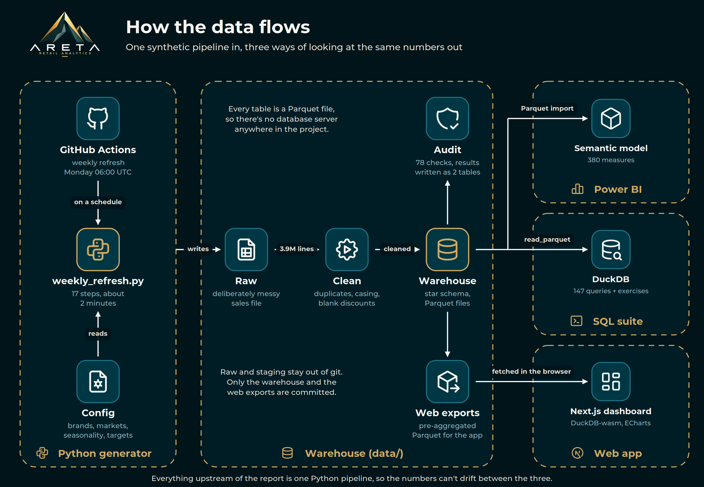
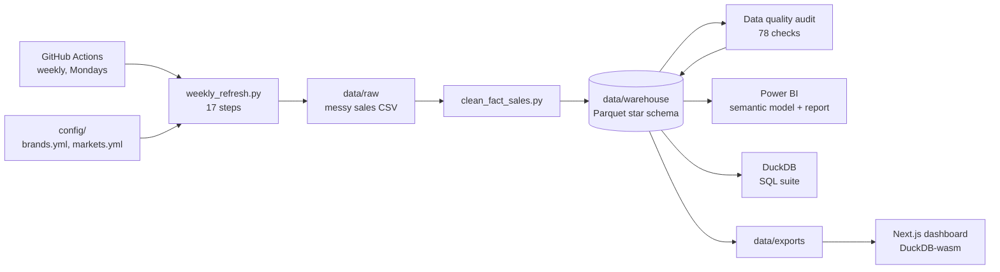
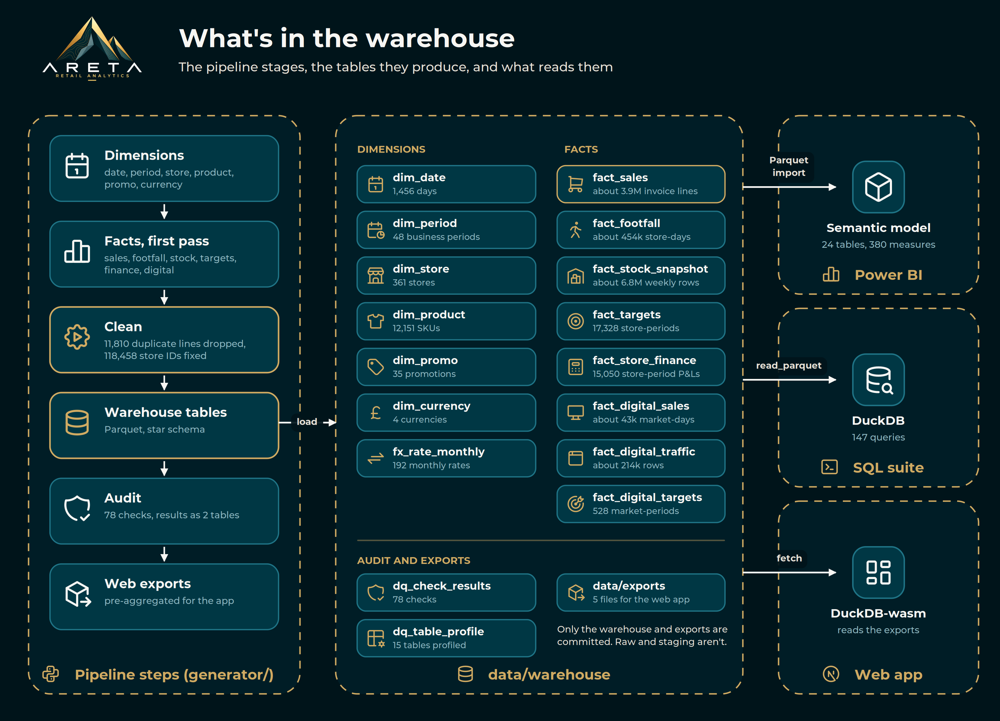
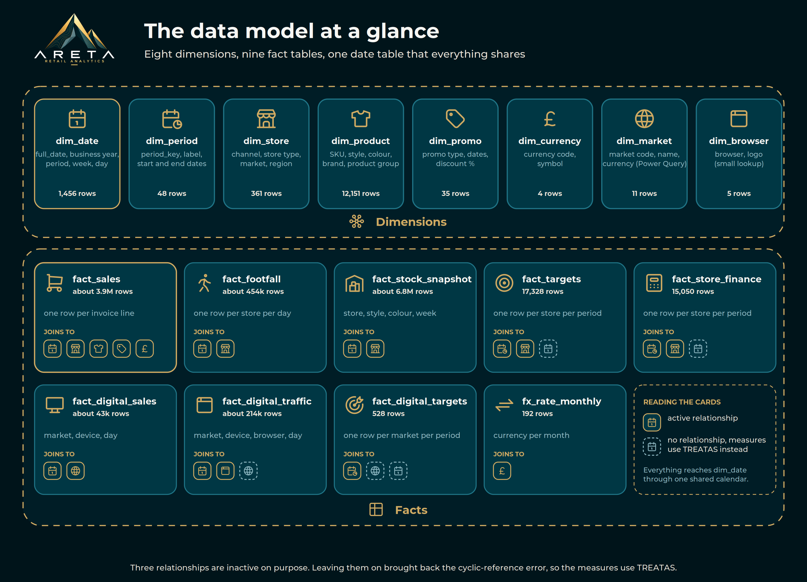
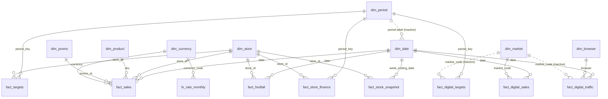

<p align="center">
  
</p>
<!-- TODO: the logo's lettering is white, so it needs a dark background. branding/areta-banner.png is the logo on the brand's dark teal. Swap it for something else if you like. -->

<h1 align="center">Areta Retail Analytics</h1>
<p align="center"><i>Higher ground awaits.</i></p>

<p align="center">
  
  
  
  
  
  
  
  
  
  <a href="https://github.com/TGOSS1984/areta-retail-analytics/actions/workflows/refresh-data.yml"></a>
  
  
</p>
<!-- TODO: the weekly refresh badge will read "no status" until the workflow has run on GitHub at least once. -->

<p align="center">
  <a href="#what-this-is">What this is</a> ·
  <a href="docs/screenshots/areta-retail-analytics.pdf">Report as a PDF</a> ·
  <a href="#run-it-yourself">Run it yourself</a> ·
  <a href="sql/README.md">SQL suite</a> ·
  <a href="#things-that-went-wrong-and-what-i-learnt">What went wrong</a> ·
  <a href="#">Live web app</a>
</p>
<!-- TODO: export the finished report to PDF and save it at docs/screenshots/areta-retail-analytics.pdf. -->
<!-- TODO: add the live web app link once it's deployed. -->

---

## Contents

1. [What this is](#what-this-is)
2. [Why I built it](#why-i-built-it)
3. [Screenshots](#screenshots)
4. [How it fits together](#how-it-fits-together)
5. [The data model](#the-data-model)
6. [Building the synthetic data](#building-the-synthetic-data)
7. [Preparing the data](#preparing-the-data)
8. [The Power BI report](#the-power-bi-report)
9. [The web app](#the-web-app)
10. [SQL, and how I used AI](#sql-and-how-i-used-ai)
11. [Things that went wrong and what I learnt](#things-that-went-wrong-and-what-i-learnt)
12. [Run it yourself](#run-it-yourself)
13. [Troubleshooting](#troubleshooting)
14. [Repo layout](#repo-layout)
15. [Roadmap](#roadmap)
16. [Docs and decisions](#docs-and-decisions)
17. [Other projects](#other-projects)
18. [Credits and licence](#credits-and-licence)

---

## What this is

Areta Mountain Systems is a made-up outdoor retailer. Everything in this repo (the stores, the products, the sales) is generated, so I can share all of it. I built it to recreate, on data I'm free to publish, the kind of retail BI I build in my day job as a merchandiser: sales and margin against last year and against target, store performance, stock cover, product productivity, all of it sliceable by market, channel and product.

It ends up as three things pointed at the same warehouse of Parquet files:

1. **A Power BI report** with a proper star-schema model, a DAX measure library and a branded theme.
2. **A web dashboard** (Next.js and DuckDB-wasm) that reads the same data in the browser, with no backend.
3. **A SQL suite** (DuckDB) that I use to question the data and to practise my SQL.

One Python pipeline feeds all three, so the numbers agree wherever you look.

| | |
|---|---|
| **The data** | About 3.9 million invoice lines, 361 stores (202 retail, 148 concession, 11 online), 12,151 SKUs across 907 styles, 4 brands, 11 markets. History starts 5 March 2023 and runs up to the day the pipeline last ran |
| **The pipeline** | 17 steps in Python, about two minutes end to end, scheduled weekly with GitHub Actions |
| **Power BI** | 24 tables, 385 measures, a Business Calendar hierarchy, a currency calculation group, 11 report pages designed |
| **The web app** | Next.js 16, DuckDB-wasm, ECharts, one dashboard page with six charts |
| **SQL** | 147 queries in 11 files plus 30 practice exercises |
| **Data quality** | 78 automated checks that run at the end of every refresh |

<!-- TODO: refresh these numbers after the next full pipeline run. They move slightly because the data is regenerated up to the current date. -->

## Why I built it

I've worked in retail merchandising for about fifteen years, and these days I run merchandising for a large multi-market European retail business: a few hundred stores, a mix of owned stores and concessions, thirteen markets. Over the last few years I've built the Power BI reporting that the merchandising and operations teams use every day, and it replaced a manual process that involved extracting from Business Objects into Excel, pivot tables, static reports and VBA. That work is on my [CV](#).

<!-- TODO: link the PDF CV on the line above. -->

So the commercial side of this project is the part I know. I know the questions: are we ahead of last year like for like, which stores are behind target, how many weeks of cover do we have, where is margin going, which styles actually carry the range. I didn't have to work out what the report should say.

What I've been learning is everything underneath. Modelling data properly (star schemas, relationships, DAX that still gives the right answer when someone slices it), building a pipeline that doesn't hand you rubbish, SQL, and getting the result onto a web front end as well as into Power BI. That's where most of the mistakes in this README came from, and where most of what I've learnt came from too.

I also wanted one project that covers the whole range: the commercial thinking, the data work, and the web development I did on the Code Institute full stack course. Most of my other projects do one of those. This one does all three, and I wanted to see how far I could push it.

<!-- TODO: decide whether you're happy naming your employer and giving the scale (stores, markets, turnover) in a public README. It's kept vague here on purpose, in line with docs/decisions/0001. -->

**About me:** [Portfolio](https://tgoss1984.github.io/tomgoss.github.io/#/) · [LinkedIn](https://www.linkedin.com/in/tom-goss-449677b0) · [GitHub](https://github.com/TGOSS1984) · [CV (PDF)](#)

<!-- TODO: add the CV link. -->

I'm looking for data analyst, BI analyst, retail insight and commercial analytics roles.

## Screenshots

<!-- TODO: take these once each page is built, save them in docs/screenshots/ under the names below, then swap each placeholder line for the image tag underneath it. -->

**Power BI report** ([full report as a PDF](docs/screenshots/areta-retail-analytics.pdf))

> Screenshot placeholder: Overview page
> <!--  -->

> Screenshot placeholder: Sales page, vs last year and vs target
> <!--  -->

> Screenshot placeholder: Products page, top styles with photos and the Pareto curve
> <!--  -->

> Screenshot placeholder: Retail page, store map and league table
> <!--  -->

> Screenshot placeholder: Data Quality page
> <!--  -->

> Screenshot placeholder: the model view in Power BI Desktop
> <!--  -->

**Web app**

> Screenshot placeholder: the dashboard
> <!--  -->

## How it fits together



Data only ever moves one way. The generator builds everything, and the three front ends read what it wrote:



The stages and the tables they produce, in a bit more detail:



A few decisions that shape everything else:

- **Parquet, no database server.** The warehouse is a folder of files. Power BI imports them, the web app reads them in the browser, and DuckDB queries them in place. Nothing needs hosting. The reasoning is in [ADR 0002](docs/decisions/0002-web-stack-simplification.md).
- **Raw and staging aren't committed.** They're regenerated every run. Only `data/warehouse` and `data/exports` are tracked, because those are what the report and the app actually read.
- **The audit never stops the pipeline.** A failing check is data, so it shows up on the Data Quality page rather than breaking the run.

The diagrams are drawn by a script ([`docs/architecture/build_diagrams.py`](docs/architecture/build_diagrams.py)) using the same icons and colours as the rest of the project, so changing a label is an edit and not a redraw.

## The data model



It's a star schema with several fact tables sharing the same dimensions. The Business Calendar in `dim_date` is the one everything reaches for year-on-year, and its business years start in early March (a 4-4-5 period pattern, twelve periods a year).



Dashed lines are the three relationships I left inactive on purpose. The reasons are [further down](#things-that-went-wrong-and-what-i-learnt), because it took a couple of errors to work them out.

| Table | One row is... | About |
|---|---|---|
| `fact_sales` | an invoice line (returns are negative lines) | 3.9M rows |
| `fact_footfall` | a store on a day | 454k rows |
| `fact_stock_snapshot` | a store, style and colour at a week ending | 6.8M rows |
| `fact_targets` | a store in a business period, for five metrics plus a gross profit value derived from sales and margin targets | 17,328 rows |
| `fact_store_finance` | a store's P&L for a business period | 15,050 rows |
| `fact_digital_sales`, `fact_digital_traffic`, `fact_digital_targets` | the website by market and device, browser or period | 43k, 214k and 528 rows |
| `dim_date`, `dim_period` | a day, and a 4-4-5 business period | 1,456 and 48 rows |
| `dim_store`, `dim_product` | a store, and a SKU (style, colour, size) | 361 and 12,151 rows |
| `dim_promo`, `dim_currency`, `fx_rate_monthly` | a promotion, a currency, and a monthly exchange rate | 35, 4 and 192 rows |

A few things in the model are there for reasons that aren't obvious from the diagram:

- **`dim_market` and `dim_browser` aren't in the warehouse.** `dim_market` is built in Power Query from `dim_store`, and `dim_browser` is a tiny lookup with the browser logos. The digital tables are keyed by market, not store, because a website doesn't have stores.
- **Targets and finance sit at period grain, not day.** Store finance only exists per period, and targets were built per period. Getting a week or day view of a target needed real work (see [Any-Grain targets](#things-that-went-wrong-and-what-i-learnt)).
- **The Data Quality tables have no relationships at all.** Deliberately. They describe the other tables, they don't filter them, and I didn't want to add anything to a relationship graph that had already caused me trouble.

The full field list is meant to live in [`docs/data-dictionary.md`](docs/data-dictionary.md).

<!-- TODO: docs/data-dictionary.md is still a template. Fill it in table by table. -->

## Building the synthetic data

The generator is in [`generator/`](generator/). Everything is driven by two config files, [`brands.yml`](generator/config/brands.yml) and [`markets.yml`](generator/config/markets.yml), plus a set of calibration values at the top of each build script. I wanted to be able to change the shape of the business by editing a number, not by rewriting code.

What's in the simulation:

- **A believable calendar.** Business years and periods, seasonality by season, a weekday curve (Saturday sells about 53% more than a Tuesday), and Black Friday and Boxing Day flags.
- **A product hierarchy** of brand, division, major product group, product group, style, colour and size, with style names taken from real mountains (Glencoe, Snowdon, Chamonix) because they read like an outdoor range and nobody owns them.
- **Channels and markets.** A dominant home market plus ten others, owned stores, concessions and an online site per market, each with its own currency (GBP, EUR, PLN, CZK).
- **Promotions and margin.** Seasonal sales, clearance, flash events and multi-buys, all written into the sales lines with their VAT and cost. Margin comes from a range per discount depth, with a small year-on-year drift on top (a squeeze from cost inflation, then a recovery) so the margin KPIs have something to show.
- **Stock, footfall and finance** built from the sales, so they agree with it. Footfall transactions are real invoice counts. Stock follows a simple reorder policy, selling down against each week's actual units and topping back up when it runs low. The store P&Ls are calibrated so gross and net contribution land in sensible ranges.
- **Targets** for five metrics, built from prior-year actuals plus a growth assumption.
- **A website**, with the online channel's actual sales split across desktop, mobile and tablet, and traffic simulated separately and calibrated to real conversion-rate benchmarks.

I got a lot of the calibration wrong before I got it right, and the two examples I remember best are worth writing down:

- **Brand share.** I wanted my lead brand to have about a third of sales *and* to supply most of the top-20 styles. I found that a single demand multiplier can't do both, because a brand with more styles has a higher best-seller purely from the maths of picking the maximum, however its total share turns out. I ended up with Areta at about 34% of sales and 14 of the top 20, and always re-check the real top 20 after touching the multiplier, because it's very sensitive to small changes.
- **Softshell topping the chart.** The first pass had Softshell as the best-selling product group, which is nonsense for an outdoor retailer. I looked up real market reports and weighted Waterproof Shell, Waterproof Insulated Jacket, Fleece and Boots up and Softshell down until the mix looked like something I'd recognise from work.

Why fictional at all is in [ADR 0001](docs/decisions/0001-fictional-brand-and-synthetic-data.md). The short version: I wanted it portfolio-safe from day one, not real employer data laundered into something close enough.

## Preparing the data

Real data is never clean, and I didn't want a portfolio dataset that was suspiciously perfect. So the first pass of the sales table is written **deliberately messy**, and [`clean_fact_sales.py`](generator/clean/clean_fact_sales.py) has to fix it before it reaches the warehouse. Out of 3,948,592 raw lines, it fixes:

| Problem | Rows affected |
|---|---|
| Exact duplicate invoice lines (found after the fixes below) | 11,810 |
| Store IDs in lower case, so they wouldn't match `dim_store` | 118,458 |
| Currency codes with stray whitespace | 78,972 |
| A blank discount on a full-price line | 153,912 |

The cleaning step also runs a foreign-key check, so an orphan store, SKU or promo stops the build instead of quietly reaching the report.

Then a separate audit ([`generator/quality/build_data_quality.py`](generator/quality/build_data_quality.py)) runs at the end of every refresh and writes two small tables that feed the Data Quality page. It runs 78 checks in seven groups: integrity, uniqueness, validity, completeness, reconciliation, freshness and cleaning. The latest run has 74 scored checks, 71 passing, 3 advisory warnings and none failing.

The three warnings are things I'd want to know about anyway: 43 traffic rows where sessions are fewer than visitors (a rounding artefact in the simulation), 4 SKUs that have never sold, and 20,581 store-days where visitors came in and nobody bought.

The reconciliations taught me the most. Digital sales, footfall transactions and footfall units all tie to `fact_sales` exactly, but only **before returns**, because returns live only in `fact_sales`. Compare them after returns and three healthy tables look broken. The Online channel in `fact_sales` comes to about £0.84M less than the digital table for exactly that reason, and the Data Quality page carries a footnote saying so.

I also mutation-tested the audit: I injected an orphan store, duplicate rows, a £100 finance discrepancy and stale digital data into a copy of the warehouse, and checked that every one of them was caught. A check that can't fail isn't worth much. Full design and build sheet: [`docs/data-quality-page.md`](docs/data-quality-page.md).

## The Power BI report

The report is saved as a Power BI Project (`.pbip`), so the model is text (TMDL) and the report is JSON, and both sit properly in git. That also meant I could inspect and validate the model outside Desktop, which is how I caught several of the problems below before they reached a visual.

**The model**

- 24 tables and 385 measures, organised into display folders (Sales and Margin, Time Intelligence, Targets, Footfall and Conversion, Channel Split, Digital, Data Quality and so on).
- **The KPI suite.** For about 30 metrics there's a full set: the value, last year, YoY change, YoY %, an arrow, a colour and a combined text line (`▼ £1,790,345 (-4.4%)`). On the report those drive the cards.
- **Targets**, in their own suite for the five targetable metrics, gross profit (value and rate) and digital sales, plus **Any-Grain** versions that work at day and week level.
- **Pareto** (at three grains), a **P&L waterfall**, a **VAT toggle** and a **Currency calculation group** that converts every monetary measure through one mechanism instead of duplicating measures.
- Two hierarchies on the date table: a Calendar Date one and a **Business Calendar** one (Year, Period, Week, Day). Year-on-year always uses the Business Calendar, because the LY measures swap the business year.

The pattern I now use for anything "compared with last year" looks like this. It's the fix for the third problem in [the section below](#things-that-went-wrong-and-what-i-learnt):

```dax
Net Units Sold LY =
    VAR CurrentYear = MAX ( dim_date[business_year] )
    VAR RelevantPeriodNumbers = VALUES ( dim_date[business_period_number] )
    VAR RelevantWeekNumbers = VALUES ( dim_date[business_week_number] )
    RETURN
        CALCULATE (
            [Net Units Sold],
            REMOVEFILTERS ( dim_date ),
            dim_date[business_year] = CurrentYear - 1,
            TREATAS ( RelevantPeriodNumbers, dim_date[business_period_number] ),
            TREATAS ( RelevantWeekNumbers, dim_date[business_week_number] )
        )
```

**The pages**

Eleven pages, each with five KPI cards and a set of visuals. The full design, with the exact measure and column behind every visual, is in [`docs/report-pages.md`](docs/report-pages.md), including which filters work on which page and why (a product filter reaches sales but not footfall or targets, so it stays off the pages where it would mislead).

| Page | What it answers | Built? |
|---|---|---|
| Home | Where do I go? Navigation and headline numbers | |
| Overview | How are we doing against last year and target? | |
| Sales | Trading by day and week, channel split, returns, the P&L bridge | |
| Products | Top styles with photos, the Pareto curve, brand and size | |
| Categories | Category mix, margin against sales, growth heatmap | |
| Retail | Store map, league table, footfall and conversion | |
| Promotional | Full price against promo, promo types, Black Friday | |
| Digital | Website sales, conversion funnel, device and browser mix | |
| Finance | Contribution, cost lines, store profitability | |
| Stock | Cover, stock by category, slow movers | |
| Data Quality | What passed, what didn't, how fresh it is | |

<!-- TODO: fill in the "Built?" column as each page is finished. It's blank on purpose. -->

**Look and feel**

- **A brand theme.** [`branding/theme/areta-theme.json`](branding/theme) is generated from the same five colours as the web app, so the two match.
- **An icon set.** I generate four variations of about a hundred icons from the Tabler set (gold on dark, teal on white, and two transparent versions) with [`generate_icons.py`](branding/icons/generate_icons.py), so nav buttons and page icons are consistent. One script, one list, four identical geometries, so I can swap a set in without anything moving.
- **Gradient bars and areas.** Power BI can't put a gradient inside each bar. I tried the "constant measure and conditional formatting" trick from a search result and it just gives every bar one solid colour, so I used the free **Deneb** custom visual instead. The Vega-Lite specs are in [`powerbi/deneb/`](powerbi/deneb/). The trade-off is that they don't pick up the report theme and have no native drill-down.
- **Product photos with fallbacks.** More on that under [things that went wrong](#things-that-went-wrong-and-what-i-learnt).

## The web app

I built the web app because I didn't want to be someone who can only work inside Power BI. I've done full stack development (React and Django, mostly), and I wanted to see how far I could take retail analytics in a browser, with the commercial and data side and the development side in one project.

It's in [`web/`](web/). Next.js (App Router) and TypeScript, Tailwind for styling, ECharts for the charts, Tabler icons, and the Montserrat brand font. The whole thing is one dashboard page: KPI cards with sparklines, and six charts (sales trend, channel mix, a Europe map with market drill-down, top products with photos, sales and margin by month, and category mix).

**How it gets its data.** There's no API and no server. The generator writes a few pre-aggregated Parquet files to `data/exports`, a small script (`scripts/sync-data.mjs`) copies them into `web/public/data` before `dev` and `build`, and the browser loads them into **DuckDB-wasm** and runs SQL against them. Each chart has a query in `web/lib/queries/` and a hook in `web/lib/hooks/`. Hosting is a static site, so it costs nothing.

The dashboard is dark themed on purpose, in the same teal and gold as the report. The two front ends read the same warehouse, so any figure on a card should match the same figure in Power BI. Checking that they do is one of my favourite tests.

The first version of the file loading hit a real bug: DuckDB-wasm threw "Invalid URL" when I registered an HTTP URL and let it fetch the file itself. Fetching the bytes myself and handing DuckDB the buffer is simpler and has been fine since.

What's not done: it's one page, mobile layout is deliberately deferred, and it doesn't show the digital metrics even though the data and the Power BI side are ready.

<!-- TODO: web/README.md is still the original "empty until the schema's stable" placeholder. Rewrite it. -->

## SQL, and how I used AI

I want to be properly good at SQL, because it's what most of the jobs I'm applying for ask for, and I learn best on data I understand. So I added a SQL suite to the project in [`sql/`](sql/), using DuckDB, which queries the warehouse's Parquet files directly. There's nothing to install except one Python package (`pip install -r sql/requirements.txt`), and `python sql/duck.py ui` opens a notebook in the browser.

What's in it:

- **Six files that teach one idea each:** exploring a database, filtering, aggregation, joins, CTEs and subqueries, and window functions.
- **Five files of business questions**, most of them the SQL twin of a report page: like-for-like sales, store against target, category margin, stock cover, website conversion, the P&L, and SQL versions of the data quality checks.
- **30 practice exercises** in five levels with hints, checks and worked solutions, plus a blank scratch pad.
- **A runner** (`duck.py`) with a `check` command that runs every query and tells me if a change to the schema has broken one.

**How I used AI to build it.** I described the business questions I'd ask as a merchandiser and used an AI assistant to draft the queries, the exercises and the runner. I didn't take any of it on trust: every query has been run against the real warehouse, the whole suite runs clean on two versions of DuckDB, and the expected results quoted in the exercises were checked against real output. The exercises are written so that I attempt each one first and only then look at the solution.

It's also how I found out things about my own data. The join queries make the "fan-out trap" obvious, where joining two fact tables directly gave me about seven times the real footfall for a week (297,377 against 40,723 in my run). And when I asked how much busier Black Friday is than a normal day, the answer was "barely at all", because the generator gives Black Friday discounts but no rise in demand. That's a gap in the synthetic data that I only spotted by querying it, and it's on the roadmap.

I'd rather be upfront about it: AI helped me build the scaffolding and the practice material faster than I could have alone, and I used it the same way throughout the project for boilerplate and syntax. The questions, the shape of the model and the checking of every number are mine. Anything it told me that mattered, I ran and tested before I believed it. The gradient trick that didn't work is a good example of why.

<!-- TODO: add a couple of lines on which exercises I found hardest once I've worked through them, and any query I rewrote. -->
<!-- TODO: name the AI tool here if you want to. -->

## Things that went wrong and what I learnt

This is the section I'd have wanted to read before I started. These are all real, and each one changed how I build things.

### Modelling and DAX

**1. The cyclic reference.** My first relationship error in Desktop was a "cyclic reference" that blocked the refresh. The cause was `dim_date` linking to `dim_period` while other tables already reached `dim_period` another way, so I made that one relationship inactive. It came back twice more when I added the digital tables, which share two dimensions with tables that already existed, so two more relationships are inactive too. What I learnt: draw the relationship graph before adding a table, and don't trust your own reasoning about it. I was wrong about it several times, and checking with a script beat thinking about it every time.

Separately, the same error showed up once on a refresh when nothing had changed. Closing Desktop, reopening and refreshing twice cleared it. My relationships file was byte for byte the same as the repo's. So before blaming the model, I now retry.

**2. Figures that were 3 to 4 times too high, but only sometimes.** I'd used `USERELATIONSHIP` to reach targets and finance through `dim_date` and `dim_period`. In an unfiltered test everything looked fine. Once I sliced by year, the targets came out 3 to 4 times too big, because `USERELATIONSHIP` doesn't reliably inherit a filter across more than one hop. I replaced all 15 affected measures with `TREATAS`. The lesson I keep repeating to myself: "checked against real data" has to include a *filtered* test, not just the all-time total.

**3. Blank year-on-year percentages.** The fix for the bug above still failed when someone filtered by period, because the label `BY25 P03` has the year inside it, so clearing the `business_year` column didn't clear the filter. The fix is the pattern in the DAX snippet above: capture the year-independent period and week *numbers* first, clear the date table, then re-apply them for last year. I applied it to about 30 measures in one sweep instead of patching one at a time.

**4. Targets at the wrong grain.** Targets are stored per store per period. Put a weekly line chart of sales next to a period target and the variance showed about -80%, because I was comparing one week's actuals to a whole period's target. The Any-Grain measures spread each period target across its days using **last year's real day-of-week pattern** (not an even split, since Saturday is much bigger than Tuesday). I checked it by summing the allocated days back up, and it matches the period target exactly under every store and market filter I tried. Contribution deliberately doesn't get one: finance actuals only exist per period, so there's nothing to compare a day with.

**5. A target that ignored the filters.** The digital target measure was a bare `SUM`, and there was no active relationship from the date table or the market table to reach it, so a date or market slicer did nothing. It was spotted by reading the relationship graph, not from a wrong number, which is a bit worrying in itself. It now uses `TREATAS` with `KEEPFILTERS`.

**6. Stock that added itself up.** Stock is a weekly snapshot, and I'd used a plain `SUM`. Select a business period and it added four or five snapshots together: period 5 showed 1,041,686 units when the stock actually on hand was about 260,600. Weeks of Cover was inflated in the same way. Stock measures now return the closing balance. On top of that, product filters couldn't reach the stock table at all, so Weeks of Cover by product group divided filtered stock by unfiltered sales. I bridged the two on style and colour, and tested the bridge against 1,402 random filter combinations. It matched an exact SKU-level match every time.

**7. The website traffic ignored the market slicer**, for the same reason as number 5 (an inactive relationship and a plain sum). It uses `TREATAS` now.

**8. Calculation groups are fussy.** The currency calculation group needed exactly two columns, no partition at all, and the model-level `discourageImplicitMeasures` setting. None of that is visible from the files, and I found each requirement through Microsoft's docs after two errors in Desktop.

**9. Small ones that each cost me an evening:** a calculated column with the wrong `columnType`, measure names that collided with column names, and conditional formatting that never went red because I'd based the rule on `Net Sales (GBP)`, which is always positive, rather than on the variance.

**10. A margin target that was an average of percentages.** For a long time the model had a target margin *rate* but no target margin *value*, and the rate was an average of each store's percentage, so a small store with a few thousand pounds of sales in a period counted the same as one selling over £100k. That's about 0.15 points out. The fix was to add a gross profit target that's simply target sales times target margin % for each store and period, and then define the margin % target as target gross profit divided by target net sales. Now the rate and the value can't disagree, and the rate is right at every level of aggregation. I also tried allocating the value target down to days using last year's weekday pattern of gross profit, and it summed back correctly but made the implied daily margin swing by up to about 2 points from weekday to weekday. Following the sales curve instead keeps the margin target flat within a period, which is how a real margin target behaves. The general lesson: never average a ratio, build it from its two parts.

### Data and pipeline

**11. Two colours became one SKU.** `colour[:3]` gave "Storm Blue" and "Stone" the same code, `STO`, which quietly created duplicate SKUs until I ran the pipeline and checked. The colour codes are now explicit, and the build refuses to write a product table with duplicate SKUs.

**12. The stock table ran my machine out of memory.** The first version worked out every style and colour a store could stock and rolled it out across all 208 weeks, about 83,600 combinations with the text repeated on every row, and the process was killed. Three things fixed it: dropping size from the grain (stock gets analysed by product group, not by size run), capping each store to a couple of hundred lines, which is also more realistic because no store carries 500 lines at once, and building the repeated text columns from integer codes instead of tiled strings. The lesson was about grain: pick the coarsest grain that still answers the question, before the table exists.

**13. Parquet that Power BI wouldn't read.** The Data Quality table failed to load with "Couldn't deserialize thrift". The culprit was almost certainly a nanosecond timestamp column that pandas writes by default. The run time is now stored as UTC text, so those files only use column types my other tables already use. I'll never put a datetime column in a Parquet file for Power BI without checking first.

**14. Power BI can't check whether an image exists.** I wanted product photos at style-and-colour level with a placeholder for anything without one. A calculated column can't make an HTTP request, so it can't test a URL. The fix was to move the decision into the generator: it looks at which image files really exist and writes the best path into the table (own photo, then product group placeholder, then major group placeholder, then an icon tile). Two things caught me out. GitHub's raw URLs are case sensitive, so `Outerwear.webp` would work on Windows and fail once pushed. And the image is chosen when the script runs, not when Power BI refreshes, so when my own placeholders didn't show up at first it was because the script needed re-running after I'd added the files.

**15. The data wasn't as realistic as I thought.** Querying it in SQL showed Black Friday sales at almost exactly 1.00 times a normal day and return rates of about 3% everywhere. Both are things a real retailer wouldn't have. It's a limitation of the generator and I've noted it rather than hidden it. The same went for margin: I'd calibrated a range per discount depth but held it constant, so every business year came out at the same 69.4% and every margin year-on-year figure read 0.0. I added a small drift over time (about -0.5 points in 2024, then +0.3 in 2025), which changes only the cost on each sale and nothing else, so the units, prices and sales are exactly as they were.

**16. A KPI that reads 0.0 everywhere is either right or broken.** My margin year-on-year and versus-target combos all showed 0.0pp, and I nearly accepted it because the data barely moved. It was both: the data was flat, *and* the combos were formatting a fraction as if it were already in points, so a real -0.5 points rounded to 0.0. The second bug had been sitting behind the first in ten measures. The rule I took from it: when a number looks suspiciously perfect, work out what it should be independently before trusting it, and make sure the test data can actually move the measure you're testing.

### The web app and tooling

**17. DuckDB-wasm and "Invalid URL"**, covered in the [web app section](#the-web-app).

**18. The AI's suggested gradient trick didn't work.** The idea of a constant measure plus conditional formatting gave one solid colour per bar, not a fade inside each bar. I only knew because I tried it. Deneb does it properly.

**Overall, what I'd tell myself at the start:** get the relationship graph right before writing any DAX, test with a filter applied every time, keep numbers reconcilable against a second source (the web app and SQL both did that job), and write the audit before you need it.

## Run it yourself

Everything upstream of Power BI works on Windows, macOS and Linux. Power BI Desktop is Windows only.

**You'll need:** Git, Python 3.12 (that's what the workflow uses), Node.js 20 or newer for the web app, and Power BI Desktop if you want the report. VS Code helps for step 6.

### 1. Clone it

```bash
git clone https://github.com/TGOSS1984/areta-retail-analytics.git
cd areta-retail-analytics
```

The repo already contains the warehouse and web exports from the last refresh, so you can skip step 3 for a quick look and use the data as it stands.

### 2. Set up Python

```bash
python -m venv .venv
# Windows PowerShell:   .venv\Scripts\Activate.ps1
# macOS or Linux:       source .venv/bin/activate
pip install -r generator/requirements.txt
```

### 3. Generate the data

```bash
python generator/weekly_refresh.py
```

It takes about two minutes and ends with `all 17 steps completed`. It writes `data/raw`, `data/staging`, `data/warehouse` and `data/exports`. The history always runs up to today's date, so figures move slightly from run to run.

The last step is the audit. To run only that, use `python generator/quality/build_data_quality.py`. It needs the full pipeline to have run before, otherwise the cleaning rows are skipped.

### 4. The web app

```bash
cd web
npm install
npm run dev
```

Open http://localhost:3000. `npm run dev` copies `data/exports` into `web/public/data` first, so if it complains that there are no exports, run step 3.

### 5. The SQL suite

```bash
pip install -r sql/requirements.txt
python sql/duck.py check      # runs every query, should report 0 problems
python sql/duck.py ui         # opens a notebook in your browser
```

Other ways in (`shell`, `run`, `schema`) and the learning path are in [`sql/README.md`](sql/README.md). The notebook needs internet once, to download a small DuckDB extension.

### 6. The Power BI report

1. **Install Power BI Desktop** (a recent version). If it won't open a `.pbip`, check Options, Preview features, for the Power BI Project (.pbip) and TMDL options.
2. **Point the tables at your copy of the data.** Each table's Power Query source has my local path written into it. In VS Code, use Search and Replace across files (Ctrl+Shift+H), restricted to the `powerbi` folder, and replace `C:\Users\tomgo\OneDrive\Documents\vscode-projects\areta-retail-analytics` with the full path to your clone. Keep the backslashes as they are, and leave the rest of each line alone.
3. **Open** `powerbi/areta-retail-analytics.pbip` and click **Refresh**. If the first refresh fails with a cyclic-reference error, close Desktop, reopen and refresh again. That's happened to me with an unchanged model.
4. **Install the Deneb visual** if you want the gradient charts. It's free from AppSource (Get more visuals in Desktop), or you can download the `.pbiviz` file from Deneb's GitHub releases and use Import a visual from a file. The specs are in `powerbi/deneb/`.
5. **Product photos** load from `raw.githubusercontent.com/TGOSS1984/areta-retail-analytics`. On a fork they'll still load from my repo, unless you change the base URL in the `image_url` column of `dim_product`.

<!-- TODO: check the exact preview-feature option names in step 1 against the current Desktop release. -->
<!-- TODO: turn the data folder into a Power BI parameter so step 2 disappears. -->
<!-- TODO: parameterise the image base URL as well. -->

### 7. Optional extras

```bash
# rebuild the four icon sets (needs `npm install` in web/ first, for the Tabler SVGs)
pip install cairosvg
python branding/icons/generate_icons.py

# redraw the architecture diagrams
pip install cairosvg pillow
python docs/architecture/build_diagrams.py
```

**The weekly refresh in GitHub Actions.** Fork the repo, enable Actions, and run the "Weekly data refresh" workflow from the Actions tab. It runs every Monday at 06:00 UTC and commits the refreshed warehouse and exports back to the repo.

<!-- TODO: the workflow has never run on a real GitHub runner. Trigger it once by hand and fix whatever falls over. -->

## Troubleshooting

The things that have actually gone wrong for me:

| What you see | Why | What to do |
|---|---|---|
| Power BI: "A cyclic reference was encountered during evaluation" on refresh | Sometimes a genuine relationship loop, sometimes a Desktop glitch on the first refresh after opening | Close, reopen and refresh twice. If it persists, check for a new relationship in `relationships.tmdl` |
| Power BI: "Couldn't deserialize thrift" | A Parquet file with a column type Power BI's reader doesn't like, usually a timestamp | Store dates as date or text, not nanosecond timestamps |
| Power BI: column not found on refresh | The table file expects a column the Parquet doesn't have yet, for example after the `dim_product` image columns were added | Re-run the generator step that builds that table, then refresh |
| Product images show the old icon tiles | The generator decides which image to use, and it hasn't been re-run since you added files | Run `python generator/dimensions/build_dim_product.py`, commit and push the images, refresh |
| Product image works locally but not in Power BI | Not pushed to GitHub, or the file name's capitalisation is different | Check the name is lower case and it's on GitHub |
| A figure is 3 to 4 times too big when you slice it | A measure using `USERELATIONSHIP` across several hops | Use the `TREATAS` pattern instead |
| Year-on-year shows blank on a period or week visual | The LY measure only cleared the year column | Same pattern, capture the period and week numbers first |
| `npm run dev`: no exports found | `data/exports` doesn't exist yet | Run the generator first |
| DuckDB notebook doesn't open | It needs internet once for the extension, and it runs on port 4213 | Check the connection and open http://localhost:4213 |
| SQL query returns odd numbers after joining two facts | Fan-out from joining tables at different grains | Sum each fact to the same grain first (see `sql/queries/04_joins.sql`) |

## Repo layout

```text
areta-retail-analytics/
├── generator/         the synthetic data pipeline (17 steps), the source of truth for everything
│   ├── config/        brands.yml and markets.yml, the knobs for the shape of the business
│   ├── dimensions/    one script per dimension
│   ├── facts/         one script per fact table
│   ├── clean/         the messy-to-clean step for sales
│   ├── quality/       the data quality audit
│   └── weekly_refresh.py   the entry point, and what GitHub Actions runs
├── data/
│   ├── warehouse/     Parquet star schema (committed)
│   ├── exports/       pre-aggregated files for the web app (committed)
│   └── raw/ staging/  regenerated every run, not committed
├── powerbi/           the .pbip project: semantic model (TMDL), report, Deneb specs
├── web/               the Next.js dashboard
├── sql/               the DuckDB SQL suite: queries, exercises, runner
├── branding/          logo, theme, and the icon generator
├── docs/              design docs, decision records, architecture diagrams
└── .github/workflows/ the weekly refresh
```

## Roadmap

Where things stand, and what's next. I'd rather this list be honest than short.

**To finish**
- [ ] Build the remaining report pages in Power BI Desktop, then take the screenshots and export the PDF
- [ ] Confirm the latest round of DAX changes in Desktop: the Any-Grain targets, the gross profit targets, the closing-balance stock measures, and the digital traffic and target fixes. They're tested against the real data, but I haven't seen them run in Desktop yet
- [ ] Trigger the GitHub Actions workflow for real and fix whatever falls over
- [ ] Deploy the web app and add the link at the top
- [ ] Fill in `docs/data-dictionary.md`

**Improvements I want to make**
- [ ] Model a promotional demand uplift in the generator (Black Friday is currently about 1.00 times a normal day)
- [ ] Turn the hard-coded data path and image URL in the Power BI project into parameters
- [ ] A closing-rate currency convention for point-in-time measures like stock value
- [ ] Web app: mobile layout, more pages, and the digital metrics
- [ ] A GitHub project board

**Parked on purpose**
- [ ] A systematic "always compare like for like" fix for the LY measures (they work at any grain today, but they don't cap themselves to elapsed periods)
- [ ] Customer type (new, returning, trade, staff), which the model doesn't have at all yet

**Tidying**
- [ ] Update the docs that are now stale: `web/README.md`, `powerbi/README.md` and `docs/project-plan.md`
- [ ] ADR 0002 says the web app uses Tremor and Zustand. It doesn't (see `web/package.json`), so the record needs correcting
- [ ] ADR 0001 says there are no product images in the repo. The product photos need a sorted source and licence, and the record should say where they came from

<!-- TODO: decide where the product photos come from and how they're credited, then update ADR 0001 and the credits at the bottom. -->

## Docs and decisions

| | |
|---|---|
| [`docs/report-pages.md`](docs/report-pages.md) | All 11 pages: KPIs, visuals, fields, and which filters reach which page |
| [`docs/data-quality-page.md`](docs/data-quality-page.md) | The audit design and the Data Quality page build sheet |
| [`docs/business-questions.md`](docs/business-questions.md) | The questions the report is meant to answer |
| [`docs/dax-measures.md`](docs/dax-measures.md) | The original measure notes (predates the `TREATAS` rewrite, so needs bringing up to date) |
| [`docs/decisions/`](docs/decisions/) | Why the data is fictional, and why the web stack is small |
| [`sql/README.md`](sql/README.md) | The SQL suite and how to practise with it |
| [`powerbi/deneb/README.md`](powerbi/deneb/README.md) | The gradient chart specs |
| [`branding/`](branding/) | Logo, theme, icons |

## Other projects

Other things I've built, with the skills each one covers:

- **[Ascent Analytics](https://github.com/TGOSS1984/ascent-analytics)**: a validated SQL warehouse, star-schema semantic model and a Power BI suite of ten dashboards built on deliberately messy operational data, with a data-quality log for every fix
- **[Retail Analytics Portfolio](https://github.com/TGOSS1984/retail-analytics-portfolio)**: relational modelling, analytical SQL, Python processing and Power BI
- **[Winter Mountain Tours Demand Predictor](https://github.com/TGOSS1984/winter-mountain-tours-demand-predictor)**: Python, scikit-learn and Streamlit, forecasting seasonal demand
- **[Summit Log UK](https://github.com/TGOSS1984/summitlog-uk)** and **[UK Summit Guides](https://github.com/TGOSS1984/uk-summit-guides)**: full stack apps with React, Django REST and PostgreSQL

## Credits and licence

MIT, see [`LICENSE`](LICENSE).

Built on the shoulders of some very good free tools: [DuckDB](https://duckdb.org) and [DuckDB-wasm](https://github.com/duckdb/duckdb-wasm), [Deneb](https://deneb-viz.github.io/), [Next.js](https://nextjs.org), [Apache ECharts](https://echarts.apache.org), [Tailwind CSS](https://tailwindcss.com), [Tabler Icons](https://tabler.io/icons) (MIT) and the Montserrat typeface (SIL Open Font Licence). The store network, products and every number are invented, and any resemblance to a real retailer is a coincidence.

<!-- TODO: add credit for the product photography once its source is sorted. -->